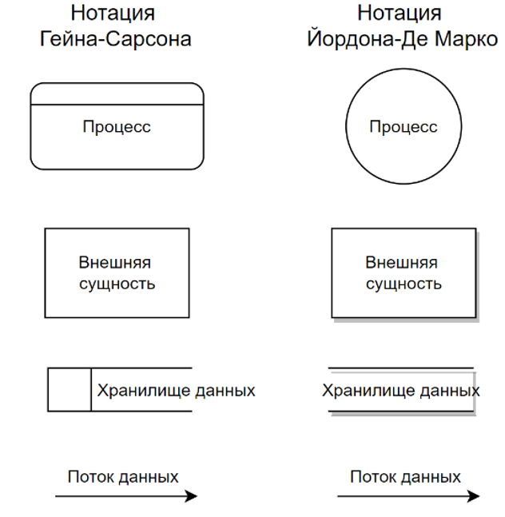
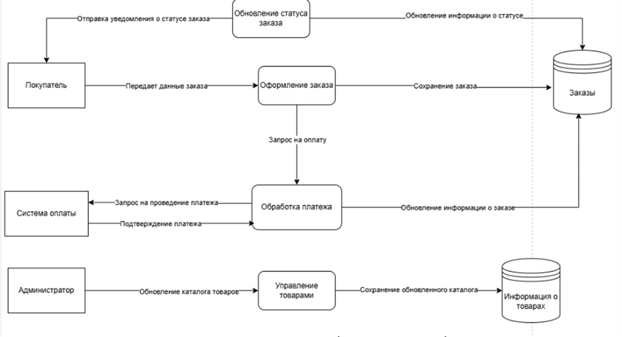
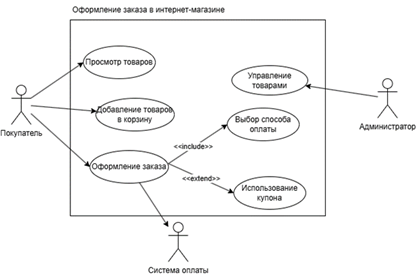
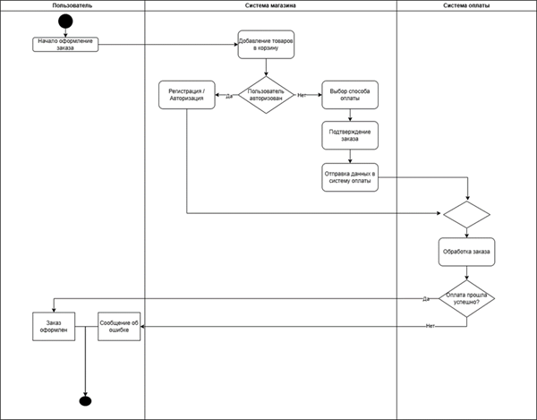

# **Лабораторная работа №2. Методы анализа предметной области: схемы DFD, UML**

## **1. Теория**

### **1.1. Анализ предметной области**
- Предметная область (ПО): совокупность процессов, объектов и связей, связанных с решением определённой задачи.
- Анализ ПО — выделение границ, функций, участников и потоков данных для построения информационной системы.

### **1.2. Что такое DFD (Диаграмма потоков данных)?**
- Диаграмма компонентов отображает логическую структуру системы, определяя программные модули и их связи.

### **1.3. Основные элементы DFD**

Таблица 1 – Описание обозначений нотации DFD

| Элемент | Описание |
| :--- | :--- |
| Процесс | Обрабатывает входные данные и передает выходные. |
| Хранилище данных | Место хранения информации (БД, файлы). |
| Внешняя сущность | Внешний участник, взаимодействующий с системой (покупатель, бухгалтер, API). |
| Поток данных | Направление движения данных между элементами. |

{ loading=lazy }

/// caption
Рисунок 1 – Обозначение нотаций DFD
///

### **1.4. Уровни детализации DFD**
- Контекстная диаграмма (DFD уровень 0)
    - Показывает систему в целом.
    - Включает один процесс, взаимодействующий с внешними сущностями.
- DFD 1-го уровня
    - Детализирует основной процесс из контекстной диаграммы.
    - Показывает подпроцессы, хранилища и потоки данных.
- DFD 2-го и 3-го уровней
     - Разбивает сложные процессы на более детализированные шаги.

### **1.5. Контекстная диаграмма (DFD 0-го уровня)**
- Сценарий: Оформление заказа в интернет-магазине
- Внешние сущности: Покупатель, Система оплаты, Администратор.
- Основной процесс: Система интернет-магазина.
- Данные:
    - Заказы.
    - Подтверждения платежей.
    - Информация о товарах.
    
{ loading=lazy }

/// caption
Рисунок 2 – Контекстная диаграмма
///

### **1.6. Диаграмма 1-го уровня (DFD)**
- Декомпозиция основного процесса на подпроцессы:
   - Оформление заказа
   - Обработка платежа
   - Управление товарами
   - Обновление статуса заказа

{ loading=lazy }

/// caption
Рисунок 3 - Декомпозиция
///

### **1.7. UML (Unified Modeling Language)**
   - Унифицированный язык моделирования, используется для визуализации и проектирования систем.
   - Use Case (диаграмма вариантов использования) — показывает, кто и как взаимодействует с системой.
   - Activity (диаграмма деятельности) — отражает последовательность действий и ветвления процессов.

### **1.8. Основные компоненты диаграммы вариантов использования:**
   - Акторы – пользователи или другие системы, которые взаимодействуют с системой.
   - Варианты использования – функциональность системы, доступная актору.
   - Связи – линии, соединяющие акторов с вариантами использования.
   - Отношения:
       - «Include» – один вариант использования обязательно вызывает другой.
       - «Extend» – один вариант использования расширяет другой в определенных условиях.
       - «Generalization» – один актер или вариант использования является обобщением другого.

###  **1.9. Пример взаимодействий:**
- Интернет-магазин: актер «Покупатель» взаимодействует с системой через варианты использования «Просмотр товаров» и «Оформление заказа». 
- Вариант использования «Оформление заказа» может включать «Выбор способа оплаты» (Include) и расширяться «Использование купона» (Extend).
   - Акторы:
    - Покупатель
    - Администратор
    - Система оплаты
   - Варианты использования:
    - Просмотр товаров
    - Добавление товара в корзину
    - Оформление заказа (Include → Выбор способа оплаты)
    - Использование купона (Extend → Оформление заказа)
    - Управление товарами (доступен только Администратору)

{ loading=lazy }

/// caption
Рисунок 4 – Пример диаграммы Use Case
///

### **1.10. Диаграмма деятельности (Activity Diagram)**
Диаграмма деятельности в UML используется для моделирования бизнес-процессов, логики работы алгоритмов и последовательности выполнения операций.

### **1.11. Основные элементы диаграммы**   
- Начало и конец – черный круг (начало) и черный круг с рамкой (конец).
- Действия (декомпозиция процесса) – прямоугольники с закругленными углами.
- Решения (ветвления) – ромбы с условиями.
- Потоки управления – стрелки, соединяющие элементы.
- Разветвление/синхронизация (fork/join) – толстые черные линии для параллельных процессов.

### **1.12. Диаграмма состояний (State Machine Diagram)**
Диаграмма состояний в UML описывает изменения состояний объекта в процессе его работы.

### **1.13. Основные элементы диаграммы состояний**
- Состояния – прямоугольники с закругленными углами.
- Переходы между состояниями – стрелки.
- События и действия – описывают, что приводит к изменению состояния.
- Начальное и конечное состояния – черный круг (начало) и черный круг с рамкой (конец).

### **1.14. Пример сценариев для диаграммы**
**Пример сценария диаграммы деятельности (Сценарий оформления заказа)**

- Покупатель оформляет заказ.
- Если есть скидка, применяется купон.
- Оплата заказа.
- Завершение процесса.

{ loading=lazy }

/// caption
Рисунок 5 – Пример диаграммы деятельности
///

**Пример сценария диаграммы состояния (Состояния заказа в интернет-магазине)**

- Новый заказ.
- Оплачивается.
- Подтвержден.
- Доставляется.
- Завершен или отменен.

---

## **2. Задание**

### **2.1. DFD**
1)  Постройте контекстную диаграмму: внешние акторы и система как один процесс, для вашей предметной области.
2)  Постройте DFD уровня 1 — разложите процесс на 3–5 подпроцессов (например: оформление заказа, оплата, доставка).
3)  Добавьте хранилища данных (например: База заказов, База клиентов).

### **2.2. UML**
1)  Создайте диаграмму вариантов использования (Use Case):
    - Акторы: Клиент, Администратор, Курьер.
    - Сценарии: поиск книги, оформление заказа, обработка заказа, доставка.
2)  Постройте диаграмму деятельности (Activity):
    - Отображает путь клиента: вход → поиск → добавление в корзину → оплата → подтверждение.
    - Используйте ветвления (например: заказ оплачен / не оплачен).

### **2.3. Для выполнения требуется:**
1) Шаблон, см. описание лабораторной.  
2) Вариант задания — связан с вами на семестр опубликован в ЛМС.  
3) Требования для оформления см. в ЛМС или раздел в документации
4) Для выполнения использовать draw.io  

### **2.4. Запрет**
Использование ИИ для решения задачи.

---

## **3. Контрольные вопросы**

1.  В чем заключается основная цель анализа предметной области перед проектированием системы?
2.  Назовите основные элементы DFD-диаграммы и их назначение.
3.  В чем разница между контекстной диаграммой DFD и диаграммой первого уровня?
4.  Какой тип диаграммы UML следует использовать для моделирования взаимодействия пользователей с системой, а какой — для описания последовательности шагов в процессе?
5.  Чем отличается отношение "include" от отношения "extend" на диаграмме вариантов использования (Use Case)?

---

## **4. Чек-лист для самопроверки**
| Баллы | Критерии выполнения |
| :--- | :--- |
| **3** | Построены все требуемые диаграммы (DFD и UML), но с недочётами: • Связи, потоки данных или акторы могут быть неполными или неточными; • Логика процессов может быть упрощена; • Работа выполнена самостоятельно, но оформление неаккуратное. |
| **2** | Построены не все требуемые диаграммы или значительная часть диаграмм выполнена некорректно (неверное применение нотаций, грубые ошибки в логике). |
| **1** | Выполнена лишь частичная работа: построена 1-2 простейшие диаграммы с многочисленными ошибками. Грубые ошибки в понимании методологий DFD/UML. |
| **0** | Работа скопирована, выполнена с помощью ИИ или не сдана. |

## **5. Скачать шаблон отчёта**
👉 [Скачать шаблон отчёта](template/LR2.docx)

