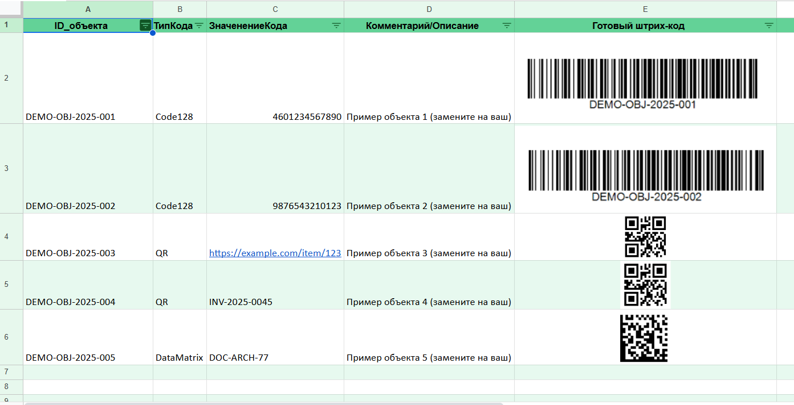
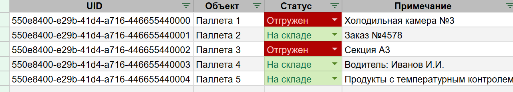
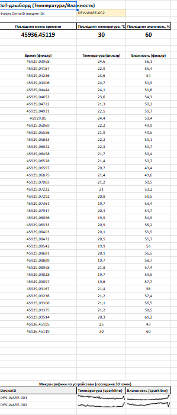

# **Лабораторная работа №3 -  Изучение устройств и технологий автоматизированного сбора данных**

## **1. Теория**

### **1.1. Роль автоматизированного сбора данных (АСД) в информационных системах**

АСД позволяет:

* создавать «цифровой след» для каждой операции;
* обеспечивать прозрачность и управляемость бизнес-процессов;
* минимизировать ручной ввод и человеческие ошибки;
* ускорять процессы учёта, анализа и контроля.

Применение: логистика, торговля, производство, медицина, транспорт, «умные» города и др.


### **1.2. Штрих-код**

Штрих-код — графическое изображение данных.
Сканер считывает отражённый свет и передаёт значение в ИС.

**Применение:** кассы, склады, идентификация документов, билетов, пробирок.

**Основные стандарты:**

* **EAN / EAN-13**
* **QR-код**
* **UPC**
* **Code 39, Code 128**


### **1.3. RFID (Radio Frequency Identification)**

RFID использует радиоволны для обмена информацией между меткой и считывателем.

**Типы меток:**

1. Пассивные — без батареи, до 10 м
2. Активные — с батареей, до 100 м
3. Полуактивные — гибрид

**Применение:**

* логистика (паллета, контейнеры)
* ритейл (антикражные системы)
* производство
* медицина
* транспорт (оплата, идентификация автомобилей)

### **1.4. IoT — Интернет вещей**

IoT — сеть умных устройств с датчиками и модулями связи.

**Архитектура:**

1. Устройства и сенсоры
2. Сети передачи данных (Wi-Fi, Bluetooth, LoRaWAN, 5G)
3. Платформы обработки (AWS IoT, Yandex IoT Core)
4. Приложения и интерфейсы

**Применение:** умные дома, города, агро-сектор, промышленность, экология.


### **1.5. Сравнение технологий**

| Технология | Достоинства                              | Недостатки                                   | Применение                         |
| ---------- | ---------------------------------------- | -------------------------------------------- | ---------------------------------- |
| Штрих-коды | Дешёвые, простые                         | Требуют прямой видимости, мало данных        | Ритейл, склад, билеты              |
| RFID       | Быстрое считывание, нет прямой видимости | Дороже, возможны помехи                      | Логистика, транспорт, медицина     |
| IoT        | Гибкость, удалённый мониторинг           | Дорогая инфраструктура, вопросы безопасности | Умные города, промышленность, агро |

### **1.6. Значение для проектирования и дизайна ИС**

При проектировании ИС необходимо учитывать:

* источники данных (штрих-код, RFID, IoT);
* формат хранения (SQL/NoSQL);
* интерфейсы;
* производительность;
* безопасность.

ИС должна предусматривать:

* интеграцию со считывающими устройствами;
* механизмы валидации;
* визуализацию (дашборды);
* масштабируемость и поддержку новых технологий.

---

## **2. Задание**  
### **2.1. Индивидуальная предметная область**

Каждый студент использует собственную предметную область.

**Примеры доменных сущностей:**

* Поликлиника: Пробирка, Пациент, Кабинет
* Склад: Паллета, Место хранения, Накладная
* Ритейл: Товар, Партия, Стеллаж
* Музей: Экспонат, Витрина, Карточка

### **2.2. Штрих-коды и QR-коды**

#### Необходимо для работы: 

- Онлайн-генераторы штрих-кодов/QR-кодов:
[https://barcode.tec-it.com/ru/](https://barcode.tec-it.com/ru/)

- Камера смартфона или онлайн-сервис считывания QR/штрих-кодов.
- Google Таблицы (как бесплатный облачный аналог базы данных).

- Структура листа «Штрих-коды» см. тут:
[https://docs.google.com/spreadsheets/d/1sDQKv3aECia8rONVT7h1qeC9AhHRGmd1_zgfk8Ousk8/edit?usp=sharing](https://docs.google.com/spreadsheets/d/1sDQKv3aECia8rONVT7h1qeC9AhHRGmd1_zgfk8Ousk8/edit?usp=sharing)


#### Задание по созднию кодов

* Сгенерируйте 3 разных кода:
  * **EAN-13 или Code128** — используйте для объекта с числовым ID (например, товар или пробирка).
  * **QR** — можно закодировать URL, текст или GUID.
  * **Свободный выбор** (ещё один штрих-/QR-/DataMatrix).
* Считайте коды (камерой телефона или онлайн-ридером).
* Зафиксируйте в таблице считанные значения в колонке «ЗначениеКода».
* Добавьте в колонку Комментарий/Описание пояснение, какой объект соответствует коду.
* Создайте минимум 5–10 строк реальных записей по объектам вашей предметной области.


#### Требование к оформлению

* Шапка таблицы (строка 1) должна быть выделена (заливка цветом + жирный шрифт).
* Включить фильтр (Google Таблицы → Данные → Создать фильтр), чтобы можно было фильтровать по «ТипКода» или «Комментарий».
* Уникальность ID_объекта: ни один объект не должен повторяться.
* Все коды должны реально сканироваться.



/// caption
Рисунок 1 – Пример заполнения кодов
///
#### Описание каждого пункта таблицы 
##### 1. **ID_объекта** — уникальный идентификатор вашей сущности в предметной области.

**Пример формата:**
`<Префикс>-<Тема>-Год-Номер>`
Примеры:

* MUSE-EXP-2025-0012 (экспонат музея)
* CLIN-TUBE-2025-0007 (пробирка в клинике)
* WARE-PAL-2025-023 (паллет на складе)

##### 2. **ТипКода** — какой именно код сгенерирован:

Code128, QR, DataMatrix (свободный выбор для 3-го примера).

##### 3. **ЗначениеКода** — считанный ответ кода с телефона.
**Готовый штрих-код** (скрин сгенерированного кода).

##### 4. **Комментарий/Описание** — что именно это за объект

(название товара, название экспоната, назначение документа и т.д.).

### **2.3. RFID (имитация)**

#### Задание по созднию кодов
Необходимо познакомиться с принципами RFID, сгенерировать уникальные идентификаторы (UID/UUID) для объектов своей предметной области и отразить их учёт в Google Таблицах.

#### Необходимо для работы: 

* Онлайн-генератор UID/UUID (например uuidgenerator.net, random.org/strings, любой другой бесплатный сервис).
* Google Таблицы (как учётная база).
* Структура листа «RFID» см. тут:
[https://docs.google.com/spreadsheets/d/1sDQKv3aECia8r0NVT7h1qeC9AhHRGmd1_zgfk8Ousk8/edit?usp=sharing](https://docs.google.com/spreadsheets/d/1sDQKv3aECia8r0NVT7h1qeC9AhHRGmd1_zgfk8Ousk8/edit?usp=sharing)


/// caption
Рисунок 2 – Пример заполнения RFID
///

#### Описание каждого пункта таблицы 
##### 1. **UID** — уникальный идентификатор
Например: `550e8400-e29b-41d4-a716-446655440000`.

##### 2. **Объект** — название сущности в вашей предметной области
Примеры: «Картина», «Пробирка крови», «Паллета», «Книга» и т.д.

##### 3. **Статус** — текущее состояние объекта

Для разных областей можно адаптировать: 

* склад: «На складе» / «Отгружено»
* музей: «В экспозиции» / «В фонде» / «На реставрации»
* клиника: «Использована» / «Готова к анализу» / «Утилизирована»

##### 4. **Примечание** — дополнительная информация
Например: дата поступления, номер партии, локация и т.д.


### **2.4. IoT-телеметрия**

#### Задание по работе с имитацией IoT-телеметрией
Познакомиться с принципами фиксации данных для IoT-телеметрии, поработать с генерацией данных, создание данных через код

#### Необходимо для работы: 

* Использование Google таблиц (как учётная базу).
* Структура листа «IoT-телеметрия» см. тут:
[https://docs.google.com/spreadsheets/d/1sDQKv3aECia8r0NVT7h1qeC9AhHRGmd1_zgfk8Ousk8/edit?usp=sharing](https://docs.google.com/spreadsheets/d/1sDQKv3aECia8r0NVT7h1qeC9AhHRGmd1_zgfk8Ousk8/edit?usp=sharing)


/// caption
Рисунок 3 – Пример заполнении IoT-телеметрия
///

#### Описание каждого пункта таблицы 
##### 1. **DeviceID** — авто-генерация в скрипте:

`DEV-<ВАШ_ДОМЕН>-NNN`
##### 2. **Показатель** — «Температура» (строка)
##### 3. **Значение** — число (18..30)
##### 4. **Время** — текущая дата/время (DateTime)
##### 5. **Влажность** — число (40..80)
##### 6. **Микро-график** — формула SPARKLINE

#### Работа с генерацией данных

1) В таблице: Extensions → Apps Script → вставьте код → сохраните → дайте права при первом запуске → в Triggers добавьте appendReadings "раз в минуту". <br>
2) В DEVICES впишите ваши DeviceID (или вызовите generateDeviceList(5) в консоли редактора и скопируйте список). <br>
3) Ручной запуск appendReadings() — проверка. <br>
4) Triggers → Time-driven → Every minute. 

> Внимание! <br>
> Необходимо будет модифицировать код под свои значения

```javascript
const SHEET_DATA = 'IoT-телеметрия';
const DEVICES = ['DEV-WARE-001','DEV-WARE-002']; // замените под свою предметную область
const DOMAIN  = 'WARE'; // ваш домен (например MUSE/CLIN/etc)

function initSheet() {
  const sh = _getSheet();
  if (sh.getLastRow() === 0) {
    sh.appendRow(['DeviceID','Показатель','Значение','Время','Влажность','Микро-график']);
  }
}

function appendReadings() {
  const sh = _getSheet();
  initSheet();
  const now = new Date();
  const rows = [];
  DEVICES.forEach(d => {
    const temp = _randInt(18, 30);
    const hum  = _randInt(40, 80);
    rows.push([d, 'Температура', temp, now, hum, '']); // микро-график заполним формулой на дашборде
  });
  sh.getRange(sh.getLastRow()+1, 1, rows.length, rows[0].length).setValues(rows);
}

/** Дополнительно: генерация DeviceID по маске DEV-<DOMAIN>-NNN */
function generateDeviceList(count) {
  const list = [];
  for (let i=1;i<=count;i++) {
    const n = String(i).padStart(3,'0');
    list.push(`DEV-${DOMAIN}-${n}`);
  }
  Logger.log(list.join(', '));
  return list;
}

// ===== helpers =====
function _getSheet() {
  const ss = SpreadsheetApp.getActive();
  return ss.getSheetByName(SHEET_DATA) || ss.insertSheet(SHEET_DATA);
}
function _randInt(min, max) { // [min..max]
  return Math.floor(min + Math.random()*(max - min + 1));
}
```

### **2.5. Создание листа «Дашборд»**
#### Задание по созднию Дашборда

Сделайте лист **«Дашборд»** и добавьте:

* **IoT-дашборд (Температура/Влажность)**
* **Фильтр DeviceID** (введите ID)
* И в соседнем поле свой ID


/// caption
Рисунок 4 – Пример заполнении листа «Дашборд»
/// 
#### Создайте три поля ниже

##### 1. Формула для первого поля:

```
=MAXIFS('IoT-телеметрия'!D:D; 'IoT-телеметрия'!A:A; $B$2)
```

##### 2. Формула для второго поля:

```
=INDEX('IoT-телеметрия'!C:C; MATCH(1; ('IoT-телеметрия'!A:A=$B$2)*('IoT-телеметрия'!D:D=$A$5); 0))
```

##### 3. Формула для третьего поля:

```
=INDEX('IoT-телеметрия'!E:E; MATCH(1; ('IoT-телеметрия'!A:A=$B$2)*('IoT-телеметрия'!D:D=$A$5); 0))
```


#### Создайте под ними ещё поля

##### 1. Последние 120 значений времени (фильтр):

```
=INDEX(
  FILTER('IoT-телеметрия'!D:D; 'IoT-телеметрия'!A:A=$B$2);
  MAX(ROWS(FILTER('IoT-телеметрия'!D:D; 'IoT-телеметрия'!A:A=$B$2))-120; 0)
)
```

##### 2. Последние 120 значений температуры:

```
=INDEX(
  FILTER('IoT-телеметрия'!C:C; 'IoT-телеметрия'!A:A=$B$2);
  MAX(ROWS(FILTER('IoT-телеметрия'!C:C; 'IoT-телеметрия'!A:A=$B$2))-120; 0)
)
```

##### 3. Последние 120 значений влажности:

```
=INDEX(
  FILTER('IoT-телеметрия'!E:E; 'IoT-телеметрия'!A:A=$B$2);
  MAX(ROWS(FILTER('IoT-телеметрия'!E:E; 'IoT-телеметрия'!A:A=$B$2))-120; 0)
)
```

#### Дополнительные формулы для микро-графиков (SPARKLINE)

##### Первая формула (температура)

```
=IF(
  ROWS(FILTER('IoT-телеметрия'!C:C; 'IoT-телеметрия'!A:A="DEV-WARE-001"))<2;
  "";
  SPARKLINE(
    QUERY(
      IFERROR(FILTER('IoT-телеметрия'!C:C; 'IoT-телеметрия'!A:A="DEV-WARE-001"));
      "offset "&MAX(ROWS(IFERROR(FILTER('IoT-телеметрия'!C:C; 'IoT-телеметрия'!A:A=$A$32)))-30; 0);
      0
    )
  )
)
```

---

##### Вторая формула (влажность)

```
=IF(
  ROWS(FILTER('IoT-телеметрия'!E:E; 'IoT-телеметрия'!A:A=$A$57))<2;
  "";
  SPARKLINE(
    QUERY(
      IFERROR(FILTER('IoT-телеметрия'!E:E; 'IoT-телеметрия'!A:A=$A$57));
      "offset "&MAX(ROWS(IFERROR(FILTER('IoT-телеметрия'!E:E; 'IoT-телеметрия'!A:A=$A$32)))-30; 0);
      0
    )
  )
)
```

### **2.6. Диаграмма компонентов (имитация)**
#### Задание по работе с диаграммой компонентов
Диаграмма должна показать, как источники данных (штрих-коды, RFID, IoT) интегрируются в информационную систему, где обрабатываются данные и в каком виде они попадают в приложения (дашборды, отчёты).

**Элементы:**

* Источники данных (устройства)
* Edge-/middleware-компоненты
* Интеграция/транспорт
* Хранилище
* Потребители

**Связи и протоколы:**

* Между компонентами должны быть подписаны протоколы или способы связи

Материалы для изучения:
[https://creately.com/blog/ru/uncategorized-ru/%D1%83%D1%87%D0%B5%D0%B1%D0%BD%D0%BE%D0%B5-%D0%BF%D0%BE%D1%81%D0%BE%D0%B1%D0%B8%D0%B5-%D0%BF%D0%BE-%D0%BA%D0%BE%D0%BC%D0%BF%D0%BE%D0%BD%D0%B5%D0%BD%D1%82%D0%BD%D0%BE%D0%B9-%D0%B4%D0%B8%D0%B0%D0%B3/](https://creately.com/blog/ru/uncategorized-ru/%D1%83%D1%87%D0%B5%D0%B1%D0%BD%D0%BE%D0%B5-%D0%BF%D0%BE%D1%81%D0%BE%D0%B1%D0%B8%D0%B5-%D0%BF%D0%BE-%D0%BA%D0%BE%D0%BC%D0%BF%D0%BE%D0%BD%D0%B5%D0%BD%D1%82%D0%BD%D0%BE%D0%B9-%D0%B4%D0%B8%D0%B0%D0%B3/)
[https://www.mindonmap.com/ru/blog/uml-component-diagram/](https://www.mindonmap.com/ru/blog/uml-component-diagram/)


/// caption
Рисунок 5 – Пример диаграммы
///

##### ТРЕБОВАНИЕ К ОФОРМЛЕНИЮ

* Все компоненты должны быть оформлены в стиле **UML Component Diagram**
  (прямоугольники с “ушками” или стандартные UML-блоки).
* Устройства (`<<device>>`) и базы (`<<database>>`) должны быть помечены стереотипами.
* Стрелки связи — с подписями протоколов.
* Обязательно разделить уровни:

  * Устройства (сверху)
  * Edge/middleware (средний слой)
  * Интеграция/обработка (ниже)
  * Хранилище и дашборды (внизу)
 

##### Индивидуализация

* На диаграмме должны использоваться доменные объекты вашей предметной области (например):

  * музей → «Экспонат»
  * клиника → «Пробирка»
  * склад → «Паллета»
  * библиотека → «Книга»

* Допускается добавление поясняющих комментариев (notes).


Ниже приведён **исправленный, структурированный и оформленный в Markdown** текст.
Исправлены ошибки, устранены опечатки («Штрих-кодыь» → «Штрих-коды»), добавлены недостающие пояснения, исправлена двойная «??» внутри ссылки, уточнены корректные пути меню AppSheet и логика настроек.

---

### **2.7. Использование Google AppSheet для создания прототипа ИС**
#### Задание по работе c Google AppSheet
Google предоставляет бесплатный сервис для создания прототипов приложений, работающих как облачная СУБД и интерфейс в одной вкладке — **AppSheet**:
[https://about.appsheet.com/how-to-create-an-app/?utm_source=sheets_tools_learn_how&utm_medium=sheets&utm_campaign=workspace_appsheet](https://about.appsheet.com/how-to-create-an-app/?utm_source=sheets_tools_learn_how&utm_medium=sheets&utm_campaign=workspace_appsheet)

##### 1. Настройка модели данных

Откройте **Data → Columns** и проверьте типы полей:

* **Идентификаторы** (`ID_объекта`, `UID`, `DeviceID`) → *Text*, **Is key = TRUE**.
* **ТипКода, Статус, Показатель** → *Enum* (перечисление).
* **Значение**, **Влажность** → *Decimal*.
* **Время** → *DateTime*.
* Включите **Scan Barcode** для полей *ЗначениеКода* и *UID*, чтобы можно было сканировать камерой смартфона.

##### 2. Интерфейс и дашборд

Откройте **UX → Views**.

Создайте новый **Dashboard** и добавьте в него:

* таблицу **Штрих-коды** (*Deck* или *Table*),
* таблицу **RFID** (*Table*),
* график из **IoT-телеметрия** (*Chart → Line*).

Включите опцию **Interactive Mode**, чтобы выбор объекта автоматически фильтровал связанные данные (мастер-детейл).

##### 3. Формы и действия

###### Формы (**UX → Views → New → Form**):

* **Штрих-коды** — форма добавления нового объекта; включите поле для сканирования штрих/QR-кода.
* **RFID** — форма изменения статуса и добавления примечания.

###### Действия (**Behavior → Actions**):

* **Отметить как «Отгружено»** — изменение поля *Статус*.
* **Вернуть на склад** — противоположное действие.
* Включите отображение действий как кнопок в таблице **RFID** (Display: *Display prominently*).

##### 4. Правила отображения (Format Rules)

Откройте **UX → Format Rules** и добавьте:

* правила по полю **Статус** — выделение цветом (например, зелёный/красный/синий);
* правило для **Значение** — подсветка, если превышен порог (например, температура > 28);
* правило для **Показатель** — добавить иконку (датчик, термометр, влажность).

##### 5. Простая автоматизация (Automation)

Откройте **Behavior → Bots**.

Пример бота:

* **Event:** изменение поля *Статус* в таблице **RFID**.
* **Process:** если `Статус = "Отгружено"`, то:

  * отправить e-mail уведомление,
  * или добавить запись в таблицу-журнал (лог событий).
##### 6. Проверка работы

* Добавьте новый объект в **Штрих-коды**, отсканируйте штрих-код или QR-код.
* Измените *Статус* объекта в **RFID** — обновление должно отображаться мгновенно.
* Откройте дашборд — графики температуры и влажности (из IoT) обновляются автоматически при появлении новых значений.
##### 7. Что сдавать

1. **Ссылка на приложение AppSheet**
   (AppSheet → Manage → Deploy → Share → *App link*).
2. **Ссылка на Google-таблицу**, из которой строилось приложение.


---

## **3. Контрольные вопросы**  
Пропускаются для этой работы. 

---

## **4. Чек-лист для самопроверки**

| Балл  | Критерии выполнения                                                                                                                                                                                                                                                                                                                                                                                                                                                                                                                                                                                  |
| ----- | ---------------------------------------------------------------------------------------------------------------------------------------------------------------------------------------------------------------------------------------------------------------------------------------------------------------------------------------------------------------------------------------------------------------------------------------------------------------------------------------------------------------------------------------------------------------------------------------------------- |
| **3** | Работа выполнена самостоятельно, но есть недочёты: <br>• Заполнены все обязательные таблицы (Штрих-коды, RFID, IoT-телеметрия), но встречаются неточности в данных; <br>• Автоматизация IoT частично работает: скрипт запускается, но не полностью корректен (ошибки в DeviceID, отсутствии SPARKLINE, неполное заполнение); <br>• Дашборд создан, но отдельные формулы или фильтры работают не полностью; <br>• Диаграмма компонентов выполнена, но упрощена: отсутствуют отдельные связи, протоколы или слои; <br>• Оформление неаккуратное, есть ошибки в структуре, но логика в целом соблюдена. |
| **2** | Выполнены не все требуемые элементы работы или значительная часть выполнена некорректно: <br>• Таблицы Штрих-кодов / RFID / IoT заполнены частично или с ошибками; <br>• Скрипт IoT не работает, данные не генерируются автоматически; <br>• Дашборд содержит ошибки: формулы не работают, выборка не фильтруется; <br>• Диаграмма компонентов содержит грубые ошибки (нарушение UML-нотаций, отсутствие стереотипов, неправильная логика взаимодействий).                                                                                                                                           |
| **1** | Выполнена лишь небольшая часть работы: <br>• Представлены отдельные таблицы, но данные неполные или некорректные; <br>• Скрипт IoT отсутствует или не запускается; <br>• Дашборд отсутствует либо создан на минимальном уровне (1-2 поля без логики); <br>• Диаграмма компонентов примитивна, содержит многочисленные ошибки или не отражает взаимодействие технологий АСД/IoT/RFID.                                                                                                                                                                                                                 |
| **0** | Работа скопирована, выполнена с помощью ИИ без переработки, содержит шаблонные данные или **не сдана**.                                                                                                                                                                                                                                                                                                                                                                                                                                                                                              |


## **5. Форма сдачи**
> Внимание! 
> При отправке ссылок настраиваете доступ по ссылке! 

Ссылки на таблицу и прототип прикрепить к ЛМС 

