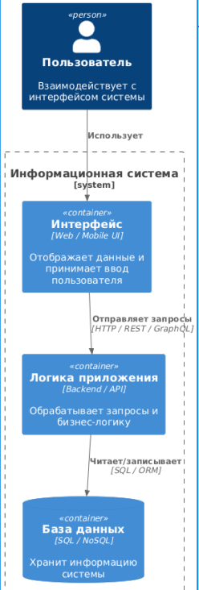
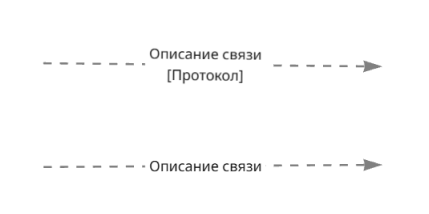
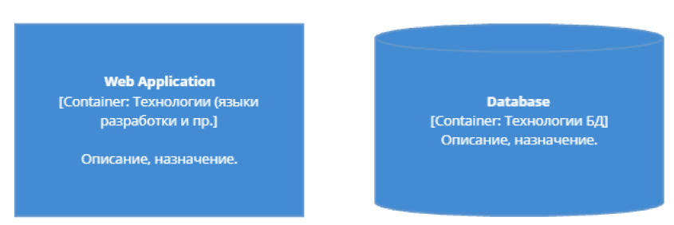
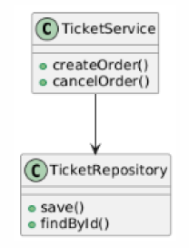

# Лабораторная работа №4 - Проектирование архитектуры информационной системы

## **1. Теория** 

### **1.1. Архитектуры информационных систем**

Архитектура определяет структуру приложения, взаимодействие компонентов и способы интеграции.

#### От выбора архитектуры зависит:

1. Сложность разработки и сопровождения
2. Выбор инструментов разработки
3. Гибкость и масштабируемость
4. Требования к инфраструктуре и команде

#### Наиболее распространённые подходы архитектур:

1. Монолитная архитектура
2. Сервис-ориентированная архитектура (SOA)
3. Микросервисная архитектура
4. Гибридная архитектура

###  **1.2. Монолитная архитектура**

Описание:
Все слои приложения (UI, бизнес-логика, база данных) находятся в едином кодовом блоке и разворачиваются как одно приложение.

Подходит для MVP, небольших проектов, стартапов.

/// caption
Рисунок 1 – Монолитная архитектура
///

#### Преимущества

* Простота разработки
* Быстрое развертывание
* Подходит для небольших приложений

#### Недостатки

* Сложно масштабировать
* Любое изменение требует пересборки всего приложения
* Высокий риск ошибок
* Ограниченная гибкость интеграций

### **1.3. Сервис-ориентированная архитектура (SOA)**

Описание:
Система разбивается на крупные бизнес-сервисы (Заказы, Платежи, Отчёты), взаимодействующие через API или ESB. Подходит для ERP, CRM, крупных корпоративных ИС.

/// caption
Рисунок 2 – Сервис-ориентированная архитектура
///

#### Преимущества

* Разделение ответственности
* Масштабирование отдельных сервисов
* Повторное использование сервисов

#### Недостатки

* Необходима единая интеграционная шина
* Требуется контроль версий контрактов
* Высокая административная нагрузка

### **1.4. Микросервисная архитектура**

Описание:
Система состоит из множества маленьких независимых сервисов с собственной базой данных и API.

/// caption
Рисунок 3 – Микросервисная архитектура
///

#### Преимущества

* Независимое обновление
* Гибкое масштабирование
* Отказоустойчивость
* Разные технологии для разных сервисов

#### Недостатки

* Требовательность к DevOps
* Необходимость оркестрации (Docker/Kubernetes)
* Сложность тестирования
* Требуется централизованное логирование, авторизация, CI/CD

### **1.5. Сравнительная таблица архитектур**

| Критерий                | Монолит            | SOA                    | Микросервисы               |
| ----------------------- | ------------------ | ---------------------- | -------------------------- |
| Структура               | Единое приложение  | Крупные бизнес-сервисы | Мелкие независимые сервисы |
| Масштабируемость        | Слабая             | Средняя                | Высокая                    |
| Сложность внедрения     | Низкая             | Средняя                | Высокая                    |
| Обновление компонентов  | Пересборка целиком | Частично               | Независимое                |
| Интеграция              | Затруднена         | Через ESB              | Через REST/gRPC            |
| Необходимые компетенции | Базовые            | Архитектурные          | DevOps, CI/CD              |
| Применение              | Небольшие ИС, MVP  | Корпоративные решения  | Облачные платформы         |

 
### **1.6. C4-модель архитектуры**

C4 = Context → Container → Component → Code
Модель показывает архитектуру «от общего к частному».

#### Уровни:

1. C1 — Контекстная диаграмма: пользователи и внешние системы
2. C2 — Диаграмма контейнеров: веб-приложение, API, база данных
3. C3 — Диаграмма компонентов: контроллеры, сервисы, репозитории
4. C4 — Диаграмма кода: классы, модули
 

#### Основные элементы C4

##### Пользователи

Персоны и внешние акторы.

/// caption
Рисунок 4 – Пользователи
///

##### Связи

Штриховые линии с подписями.

/// caption
Рисунок 5 – Связи
///

##### Программная система

Блок, отображающий разрабатываемое решение.

/// caption
Рисунок 6 – Программная система
///

##### Контейнер

Веб-приложение, API-сервер, БД, очередь сообщений, мобильное приложение.

/// caption
Рисунок 7 – Контейнер
///
 

### **1.7. C1 — Контекстная диаграмма**

Показывает:

* систему
* внешние системы
* пользователей

/// caption
Рисунок 8 – Контекстная диаграмма
///  
### **1.8. C2 — Диаграмма контейнеров**

Показывает структурные блоки:

* Web App
* API Server
* Database
* Мобильное приложение
* Очередь сообщений / микросервис

Контейнер ≠ Docker (здесь логическая сущность, не виртуализация).

/// caption
Рисунок 9 – Диаграмма контейнеров
///   

### **1.9. C3 — Диаграмма компонентов**

Показывает:

* модули
* сервисы
* классы / пакеты

Компоненты группируются по ответственности:
контроллер, сервис, репозиторий, модель.

/// caption
Рисунок 10 – Диаграмма компонентов
///   

### **1.10. C4 — Диаграмма кода**

Показывает:

* классы
* интерфейсы
* методы
* связи

Обычно выполняется в UML.

/// caption
Рисунок 11 – Диаграмма кода
///   

### **1.11. Взаимосвязь уровней C4**

C1 — контекст →
C2 — контейнеры →
C3 — компоненты →
C4 — код

---

## **2. Задание**  

### **2.1. Вариант задания**

1) Ознакомиться с архитектурами и C4-нотацией.  
2) Нарисовать для своей ИС 3 архитектуры на уровне C1: 
2.1) монолит 
2.2) SOA 
2.3) микросервисы 
3) Приложить 3 PDF-файла к отчёту. 
4) Ответить на контрольные вопросы.

### **2.2. Для выполнения требуется:**
1) Шаблон, см. описание лабораторной.  
2) Вариант задания — связан с вами на семестр опубликован в ЛМС.  
3) Требования для оформления см. в ЛМС или раздел в документации
4) Для выполнения использовать draw.io  

### **2.3. Запрет**
Использование ИИ для решения задачи.

---

## **3. Конрольные вопросы**
1. Чем отличаются монолит и микросервис с точки зрения обновления кода?
2. Что такое API и зачем оно нужно при архитектуре SOA/микросервисов?
3. Почему важно, чтобы у каждого микросервиса была своя база данных?
4. Какие риски могут возникнуть при неправильном делении на микросервисы?
5. Какую архитектуру проще протестировать и сопровождать в учебном проекте?

##  **4. Чек-лист для самопроверки**
| Баллы | Критерии выполнения                                                                                                                                                                                                                                                                                                           |
| ----- | ----------------------------------------------------------------------------------------------------------------------------------------------------------------------------------------------------------------------------------------------------------------------------------------------------------------------------- |
| 3 | Работа выполнена полностью и самостоятельно. Представлены 3 контекстные диаграммы C4: монолит, SOA, микросервисы. Все диаграммы выполнены корректно, с обозначением пользователей, внешних систем и связей. В отчёт включены ответы на контрольные вопросы; оформление соответствует требованиям (PDF + файл отчёта). |
| 2 | Диаграммы выполнены, но есть неточности: отсутствуют элементы, допущены ошибки в обозначениях или связях; либо не полностью оформлен отчёт. Однако работа явно выполнена самостоятельно, структура в целом корректна.                                                                                                 |
| 1 | Представлены частично выполненные материалы: только 1–2 диаграммы или диаграммы без подписей/структуры; ответы на вопросы отсутствуют или неполные. Требования к оформлению нарушены. Видно, что работа выполнялась, но качество низкое.                                                                              |
| 0 | Работа скопирована, выполнена исключительно с помощью ИИ, не содержит следов самостоятельной деятельности, или не сдана.                                                                                                                                                                                          |

 

## **5. Скачать шаблон отчёта**

👉 [Скачать шаблон отчёта](template//LR4.docx)
