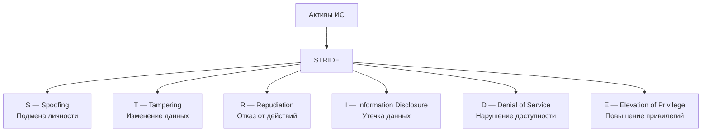
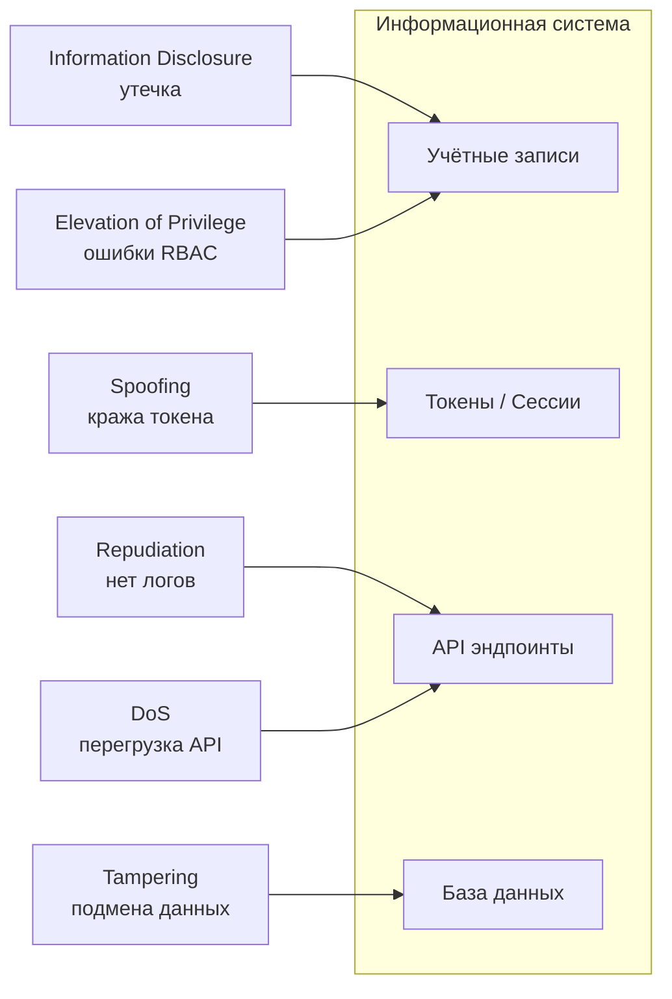
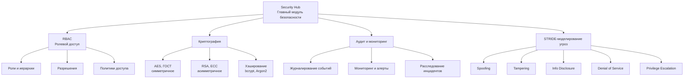

# Лабораторная работа №4 -  Аналализ угроз и обеспечение безопасности информационных систем
 
## 1. Цель работы

1. Освоить методы анализа угроз и моделирования рисков.
2. Изучить ролевую модель разграничения доступа RBAC.
3. Освоить применение симметричного и асимметричного шифрования, хэширования.
4. Провести аудит действий пользователей в ИС.
5. Научиться интерпретировать связи между RBAC, криптографией, угрозами и аудитом.

---

## 2. Теория

### 2.1. Основы информационной безопасности

Информационная безопасность обеспечивает:

* **Конфиденциальность** — защита от несанкционированного доступа.
* **Целостность** — защита от несанкционированного изменения.
* **Доступность** — обеспечение своевременного доступа к данным.

Эти три понятия образуют триаду **CIA** (Confidentiality, Integrity, Availability).

---

### 2.2. Активы, угрозы, уязвимости и риски

#### Активы

* Личные и корпоративные данные
* Учётные записи
* API и окружение
* База данных
* Конфигурации, ключи шифрования

#### Уязвимость

Слабое место системы: ошибки настройки, отсутствие валидации, слабые пароли, отсутствие шифрования, некорректный RBAC.

#### Угроза

Потенциальные действия или события, способные причинить ущерб активам.

#### Риск

Риск = вероятность угрозы × ущерб.
Оценивается как Low / Medium / High.

---

### 2.3. Модель STRIDE

Используется для систематизации угроз:

| Тип | Название               | Описание                      |
| --- | ---------------------- | ----------------------------- |
| S   | Spoofing               | Подмена личности              |
| T   | Tampering              | Нарушение целостности данных  |
| R   | Repudiation            | Отказ от совершённых действий |
| I   | Information Disclosure | Утечка информации             |
| D   | Denial of Service      | Нарушение доступности         |
| E   | Elevation of Privilege | Повышение привилегий          |

---

### 2.4. Архитектурные принципы безопасности

* **Минимальные привилегии** (Least Privilege)
* **Zero Trust** — каждый запрос должен быть проверен
* **Defense-in-Depth** — несколько уровней защиты
* **Fail-Safe** — безопасный отказ
* **Auditability** — обязательная фиксация действий

---

### 2.5. RBAC — ролевая модель управления доступом

Стандарт NIST RBAC включает:

* **Пользователей**
* **Роли**
* **Разрешения** (операции над ресурсами)
* **Сессии**

Иерархии ролей позволяют упростить управление доступом.

**Преимущества RBAC:**

* снижение числа ошибок,
* масштабируемость,
* удобство аудита,
* соответствие регуляторам.

---

### 2.6. Криптография

#### Симметричное шифрование

Алгоритмы: AES-128/192/256, ГОСТ 28147-89, ChaCha20.
Особенность: один ключ, высокая скорость.

#### Асимметричное шифрование

Алгоритмы: RSA, ECC, ГОСТ Р 34.10.
Особенность: пара ключей — приватный и публичный.

#### Хэширование

Алгоритмы: SHA-256, bcrypt, Argon2.
Используется для безопасного хранения паролей.

#### Электронная подпись

Обеспечивает аутентичность, целостность, неотказуемость.

---

### 2.7. Аудит, логирование и мониторинг

Обязательные события для логирования:

* успешный/неуспешный вход,
* изменение ролей и прав,
* операции CRUD над критичными ресурсами,
* ошибки и исключения,
* аномалии.

Требования:

* временная синхронизация (NTP),
* недоступность логов для правок,
* централизованное хранение (ELK, SIEM),
* защита логов от изменения.

---

## 3. Диаграммы STRIDE

### 3.1. Общая диаграмма STRIDE

---

### 3.2. STRIDE для конкретной информационной системы

---

## 4. Интерактивная схема безопасности

#### (RBAC + Криптография + Аудит + STRIDE)

> Формат: **Markdown + React Flow JSON**, чтобы его можно было сразу вставить в проект.

---

### 4.1. Логическая схема безопасности (Markdown-диаграмма)

 

## 5. Задание 

1. Выполнить анализ активов и таблицу угроз по STRIDE.
2. Составить RBAC-модель: роли, разрешения, матрицу доступа.
3. Реализовать:

   * шифрование AES,
   * шифрование RSA,
   * хэширование SHA-256 / bcrypt / Argon2.
4. Настроить аудит: входы, ошибки, изменения данных.
5. Сформировать отчёт в Markdown или DOCX.

--- 

# 6. Контрольные вопросы

1. **Что является ключевыми отличиями между симметричным и асимметричным шифрованием?**
   Объясните различия в механизме работы, применимости и управлении ключами.

2. **Какие типы угроз описывает модель STRIDE и как каждая из них может проявляться в веб-сервисе?**
   Приведите минимум по одному примеру на каждый элемент STRIDE.

3. **Почему хэширование паролей считается обязательной мерой безопасности, и в чём отличие хэша от шифра?**
   Объясните, почему хранение «обычных» паролей недопустимо.

4. **Как принципы RBAC помогают уменьшить риск угроз категории Elevation of Privilege?**
   Раскройте понятия минимальных привилегий, разделения обязанностей и ролевой иерархии.

5. **Какие события должны обязательно логироваться в системе и почему аудит является критически важным для расследования инцидентов?**
   Приведите примеры обязательных событий и раскройте роль SIEM.

---

# 7. Чек-лист оценки работы

| Балл  | Критерии                                                               |
| ----- | ---------------------------------------------------------------------- |
| **3** | Полный анализ угроз, диаграммы STRIDE, RBAC, шифрование, аудит, выводы |
| **2** | Выполнено частично, не хватает 1–2 блоков                              |
| **1** | Работа поверхностная, без анализа и практики                           |
| **0** | Работа скопирована / выполнена ИИ без переработки / не сдана           |

 