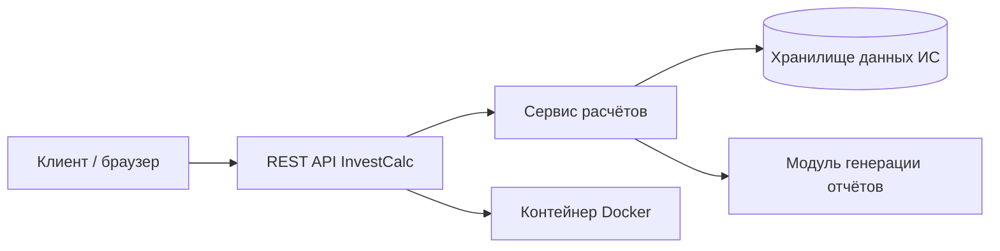

# Легенда проекта и структура InvestCalc

## Легенда проекта

Команды представляют агентство цифрового консалтинга **DataForge**. К агентству обращаются компании, которым необходимо рассчитывать экономическую эффективность различных информационных систем: ERP, CRM, HelpDesk, сервисов бронирования, систем учёта, мобильных приложений и других решений.

У DataForge отсутствует единая платформа для оценки окупаемости, поэтому команды создают сервис **InvestCalc**, который позволяет:

- вводить данные по системе;
- сравнивать локальные и облачные сценарии;
- рассчитывать чувствительность;
- формировать готовый аналитический отчёт (HTML/PDF);
- использовать сервис как внутренний продукт агентства.

**Итог проекта:** рабочий сервис, который можно показать «клиенту-заказчику».

---

## Предметные области

Каждая команда выбирает свою **тематическую область**. Команда получает «клиента» из определённой отрасли, которому требуется рассчитать эффективность внедрения ИС.

Предметная область:

- согласуется внутри команды;
- сообщается преподавателю;
- фиксируется в описании проекта (README / отчёт / презентация).

---

## Структура проекта

### Серверная часть

Реализуется минимальный **REST API** для расчётов:

- `/calc/local` — расчёт показателей для локального сценария;
- `/calc/cloud` — расчёт показателей для облачного сценария;
- `/calc/sensitivity` — анализ чувствительности (±20%);
- `/compare` — сравнение нескольких ИС и/или сценариев.

Формулы берутся по шаблону **лабораторной работы №6**.

### Интерфейс или CLI

Любой удобный вариант:

- веб-форма ввода данных (форма для параметров ИС);
- вывод таблиц с результатами;
- мини-дашборд с ключевыми метриками (TCO, ROI, Payback Period, рейтинг вариантов);

или

- консольный интерфейс (CLI) с интерактивным вводом и выводом таблиц в текстовом виде.

### Генератор отчёта

- формирование **HTML-отчёта** (обязательно);
- при желании — конвертация HTML → **PDF**;
- включение таблиц, графиков (опционально) и итоговой аналитики;
- краткие текстовые выводы по результатам сравнения.

### Docker

- `Dockerfile` для приложения;
- при необходимости — `docker-compose.yml` (если есть база данных или несколько сервисов);
- инструкция по запуску контейнера.

### GitHub-репозиторий

- продуманная структура проекта (папки `src/`, `docs/`, `docker/` и т.п.);
- файл `README.md` с описанием:
  - что делает сервис;
  - как его запустить (локально и через Docker);
  - примеры запросов к API;
  - пример входных данных;
  - скриншоты интерфейса (если есть);
- оформленный **релиз** (release) или пометка тега финальной версии.

### Финальная презентация

Краткая презентация (примерно 8–10 слайдов):

- предметная область и «клиент»;
- модель расчёта (основные показатели);
- архитектура InvestCalc;
- результаты расчётов;
- анализ чувствительности;
- выводы и рекомендации.

---

## Диаграмма архитектуры (Mermaid)

Ниже приведён пример диаграммы архитектуры мини-системы **InvestCalc** на Mermaid.  
При подключённой поддержке Mermaid на сайте этот блок будет отображаться как схема.

---

## План демонстрации по занятиям

### Занятие 1 — Постановка задачи и разработка модели

**Цели:**

- выбрать предметную область;
- определить бизнес-проблему «клиента»;
- собрать исходные данные;
- подготовить модели расчёта (по ЛР6).

**Результат:**

- таблица исходных данных (для локального и облачного сценария);
- сценарный анализ (варианты, допущения);
- черновая модель в Python / JavaScript (или другом языке).

**Демонстрация:**

- представление предметной области и клиента;
- объяснение логики расчётов;
- файл с вычислениями (скрипт, ноутбук, таблица).

---

### Занятие 2 — API и архитектура мини-ИС

**Цели:**

- создать структуру проекта (папки, базовые файлы);
- реализовать API для расчёта ROI, TCO, Payback Period;
- разработать архитектуру (контроллер → сервис → модель);
- загрузить проект в GitHub (первый рабочий вариант).

**Результат:**

- первый рабочий эндпоинт (хотя бы один метод расчёта);
- архитектурная схема (PlantUML или Mermaid);
- репозиторий на GitHub с кодом и базовым README.

**Демонстрация:**

- вызов API (через браузер, curl или Postman);
- пример JSON с результатами расчёта;
- просмотр коммитов и структуры репозитория.

---

### Занятие 3 — Анализ чувствительности, отчёт, Docker

**Цели:**

- реализовать сценарии анализа чувствительности (±20% ключевых параметров);
- сформировать HTML/PDF‑отчёт;
- создать `Dockerfile` и при необходимости `docker-compose.yml`;
- протестировать сборку и запуск сервиса в контейнере.

**Результат:**

- рабочий Docker‑контейнер;
- отчёт (HTML и, опционально, PDF);
- сценарный анализ с несколькими вариантами.

**Демонстрация:**

- запуск контейнера;
- демонстрация сгенерированного отчёта;
- показ сценарного анализа.

---

### Занятие 4 — Финальная сборка и презентации

**Цели:**

- выполнить итоговое тестирование;
- оформить кейс (описание клиента, задачи, решений);
- подготовить финальную презентацию;
- провести питч перед группой и преподавателем.

**Демонстрация:**

- рабочая система (интерфейс или API);
- сравнение «локальная vs облачная» модель;
- финальный доклад команды.

---

## Финальная презентация

Финальная мини-презентация строится по структуре:

- название проекта;
- ситуация клиента и его боль;
- исходные данные и допущения;
- архитектура InvestCalc;
- основные результаты расчётов;
- анализ чувствительности;
- выводы (что выгоднее: локальная или облачная модель, при каких условиях);
- демонстрация работающего прототипа.

---

## Критерии оценивания

**Бизнес-логика и расчёты — 3 балла** 

- корректная реализация формул (по ЛР6);
- наличие локального и облачного сценария;
- реализованный анализ чувствительности.

**API, интерфейс и архитектура — 2 балла**

- чистая и понятная структура проекта;
- реализованы ключевые эндпоинты;
- присутствует архитектурная диаграмма (PlantUML / Mermaid / C4 и др.).

**Docker — 1 балл**

- система запускается одной (или несколькими понятными) командами;
- контейнер собирается и запускается без ошибок.

**GitHub — 1 балл**

- оформленный `README.md`;
- осмысленные коммиты;
- инструкция по запуску;
- примеры входных данных и/или запросов.

**Рабочий прототип — 1 балл**

- есть интерфейс (web/CLI) или удобные API‑эндпоинты;
- работает генерация отчёта.

**Презентация — 2 балла**

- логичная структура;
- визуализация ключевых результатов (таблицы, графики, схемы);
- понятные выводы по проекту.

**Итоговое количество баллов = 10**

---

## Примечание для команд

Команды могут использовать любые инструменты, технологии, фреймворки, библиотеки и источники, которые считают необходимыми для реализации проекта, **за исключением прямой помощи преподавателя при выполнении задания**. 
При описания занятий по дням, данные могут расширяться.

Допустимые ресурсы включают:

- официальные документации и мануалы;
- форумы и сообщества, GitHub, StackOverflow;
- генераторы документации, линтеры, тестовые наборы;
- инструменты моделирования (Miro, Draw.io, Figma, PlantUML и др.);
- любой софт для разработки (PyCharm, VS Code, IntelliJ IDEA, Rider, WebStorm и др.);
- системы для командной работы (Discord, Trello, Notion и т.п.).

**Языки разработки:** Python, JavaScript/TypeScript, C#, Java, Go, PHP, Kotlin и любые другие по выбору команды.  

Главное условие — финальный прототип должен быть:

- рабочим;
- запускаться с помощью Docker (если выбран Docker‑подход);
- достаточно прозрачным и понятным для проверки.
