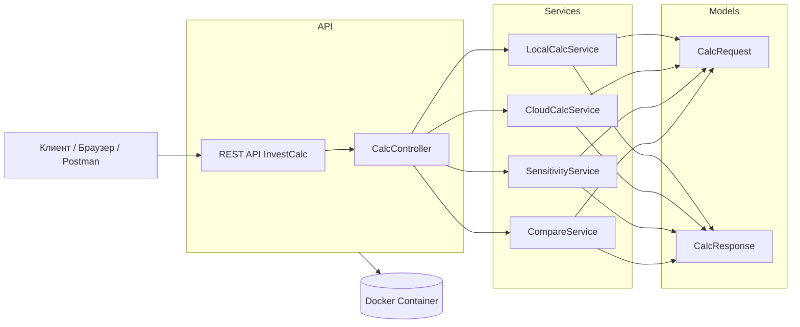

# День 2 — API и архитектура мини-информационной системы InvestCalc  
(вторая неделя проектной работы — создание каркаса сервиса)

## Цели занятия

К концу занятия команда должна:

- сформировать первичную структуру проекта (папки, файлы, модели, сервисы, контроллеры, точка входа);
- разработать архитектуру системы, включающую:
  - API-контроллеры,
  - сервисный слой,
  - модели запросов и ответов,
  - базовую расчётную логику,
  - структуру эндпоинтов `/calc/local`, `/calc/cloud`, `/calc/sensitivity`, `/compare`;
- реализовать первый рабочий API-метод (**/calc/local**, выполняющий базовый расчёт TCO, ROI и Payback Period);
- загрузить результаты в GitHub:
  - ветку `feature/api`,
  - набор коммитов,
  - Pull Request в `develop`,
  - обновлённый README с описанием API и архитектуры;
- подготовить архитектурную диаграмму в Mermaid или PlantUML.

---

## Минимальная структура проекта

Структура отражает уровни приложения: API → сервисы → модели → расчётная логика.

### Вариант для C# / ASP.NET Core

```
src/
│
├── api/
│   └── CalcController.cs
│
├── services/
│   ├── LocalCalcService.cs
│   ├── CloudCalcService.cs
│   ├── SensitivityService.cs
│   └── CompareService.cs
│
├── models/
│   ├── CalcRequest.cs
│   └── CalcResponse.cs
│
└── Program.cs
```

### Python

```
src/
├── api.py
├── services/
├── models/
└── utils/
```

### Node.js

```
src/
├── controllers/
├── services/
├── models/
└── index.js
```

Структура должна быть загружена в репозиторий **до реализации** сложной логики.

---

## Архитектура InvestCalc

### Общий поток работы сервиса

Архитектура основана на разделении ответственности:

Клиент → REST API → Контроллер → Сервис → Модели → Ответ

### Архитектурная диаграмма (Mermaid)



---

## Реализация минимального API-эндпоинта
Внимвание, делим 4 эдпоинда на количество членов команда = полученное число, это столько сколько должен сделать каждый члек команды! 

Первый метод — `/calc/local`, выполняющий расчёты TCO, ROI и Payback Period.

### Пример реализации (C#)

#### Модель запроса

```csharp
public class CalcRequest
{
    public string ProjectName { get; set; }
    public double Capex { get; set; }
    public double Opex { get; set; }
    public double TrainingCosts { get; set; }
    public int PeriodYears { get; set; }
    public double ExpectedSavingsPerYear { get; set; }
    public double ExpectedRevenueGrowthPerYear { get; set; }
}
```

#### Сервис

```csharp
public class LocalCalcService
{
    public CalcResponse Calculate(CalcRequest req)
    {
        double tco = req.Capex + req.Opex * req.PeriodYears + req.TrainingCosts;
        double benefits = (req.ExpectedSavingsPerYear + req.ExpectedRevenueGrowthPerYear) * req.PeriodYears;
        double roi = ((benefits - tco) / tco) * 100;
        double payback = tco / (req.ExpectedSavingsPerYear + req.ExpectedRevenueGrowthPerYear);

        return new CalcResponse(req.ProjectName, tco, roi, payback);
    }
}
```

#### Контроллер

```csharp
[ApiController]
[Route("calc")]
public class CalcController : ControllerBase
{
    private readonly LocalCalcService _local;

    public CalcController(LocalCalcService local)
    {
        _local = local;
    }

    [HttpPost("local")]
    public IActionResult Local(CalcRequest req)
    {
        var result = _local.Calculate(req);
        return Ok(result);
    }
}
```

---

## Проверка API

Инструменты:

- Postman  
- Thunder Client (VS Code)  
- curl  
- Swagger UI  

### Пример JSON-запроса

```json
{
  "projectName": "CRM для отдела продаж",
  "capex": 500000,
  "opex": 120000,
  "trainingCosts": 80000,
  "periodYears": 3,
  "expectedSavingsPerYear": 300000,
  "expectedRevenueGrowthPerYear": 200000
}
```

### Ожидаемый ответ

```json
{
  "projectName": "CRM для отдела продаж",
  "tco": 960000,
  "roi": 156.25,
  "paybackPeriodYears": 1.5
}
```

---

## Работа с GitHub

### Создание ветки для API

```bash
git checkout -b feature/api
```

### Загрузка каркаса проекта

```bash
git add .
git commit -m "feat: added API structure and LocalCalc endpoint"
git push origin feature/api
```

### Pull Request

PR должен содержать:

- описание изменений,
- ссылку на issue,
- скриншоты проверки в Postman/Swagger,
- пример запроса и ответа.

---

## Обновление README

README должен включать:

### API эндпоинты

```
POST /calc/local 
POST /calc/cloud
POST /calc/sensitivity
POST /compare
```

Также необходимо добавить:

- примеры запросов/ответов,
- архитектурную диаграмму Mermaid,
- назначение каждого эндпоинта,
- при необходимости — вынести примеры в `docs/examples/`.

---

## Демонстрация работы команды

Команда должна показать:

- архитектурную диаграмму (Mermaid/PlantUML);
- структуру проекта в GitHub;
- первый рабочий метод API `/calc/local`;
- ветки, коммиты, PR;
- обновлённый README с архитектурой и API.


---

## Итог занятия (результат)

Команда предоставляет:

| Результат | Файл |
|----------|------|
| Архитектура | `docs/architecture.md` |
| Структура проекта | `src/` |
| Первый API | `src/api/CalcController.cs` |
| Расчётный сервис | `src/services/LocalCalcService.cs` |
| Пример запроса/ответа | `docs/examples/local.json` |
| Диаграмма | `docs/architecture.mmd` |
| GitHub PR | ссылка |

