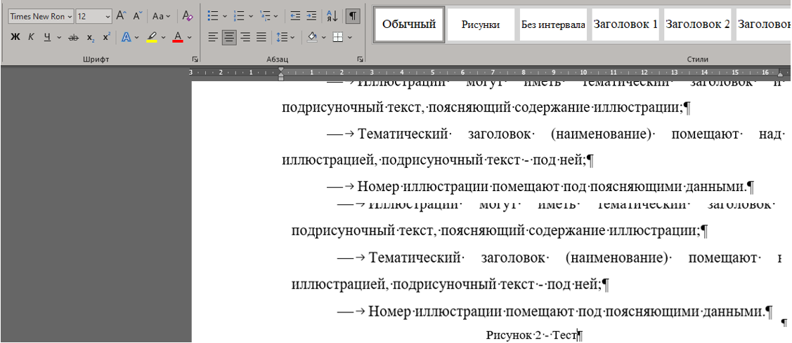

# **ТРЕБОВАНИЕ К ОФОРМЛЕНИЮ**

## **1. Оформление по ГОСТ**
### **1.1. Что такое ГОСТ?**

ГОСТ (Государственный стандарт) — это набор правил, технических требований, методов испытаний и других стандартов, регламентирующих процессы, продукцию и услуги в России.

ГОСТы разрабатываются и утверждаются государственными органами и служат для обеспечения:

* качества,
* безопасности,
* эффективности различных продуктов и процессов.

ГОСТы применяются в промышленности, строительстве, ИТ, медицине и других сферах.


### **1.2. Причина использования ГОСТа**

Использование ГОСТов в документации необходимо для:

1. **Обеспечения качества** — стандарты помогают улучшать процессы и продукцию.
2. **Обеспечения безопасности** — важны для технической и медицинской документации.
3. **Унификации и стандартизации** — упрощают взаимодействие между участниками процесса.
4. **Соблюдения законодательства** — обязательны в ряде сфер (строительство, медицина и др.).


### **1.3. ГОСТы, используемые при работе с ИС в РФ**

В области информационных систем применяются ГОСТы по информационной безопасности, обработке данных и техническим характеристикам ПО.

| № | Название             | Ссылка                                                                           |
| - | -------------------- | -------------------------------------------------------------------------------- |
| 1 | ГОСТ Р 34 АСУ        | [https://www.swrit.ru/gost-34.html](https://www.swrit.ru/gost-34.html)           |
| 2 | ГОСТ Р ИСО/МЭК 27001 | [https://www.swrit.ru/gost-iso-mek.html](https://www.swrit.ru/gost-iso-mek.html) |


### **1.4. Оформление текста по 34 ГОСТу**

#### **1.4.1. Оформление титульного листа**

* Выполняется по шаблону университета.
* Не нумеруется.

#### **1.4.2. Оформление текста**

При работе с информационными системами используется **34 ГОСТ АСУ**, а требования к структуре документа идут по:

* **ГОСТ 19.201** — Техническое задание. Требования к содержанию и оформлению.
* Нормативные ссылки: ГОСТ 19.106–78 и ГОСТ 2.301–68 (утратил силу).

---

## **2. ПРИМЕР ОФОРМЛЕНИЯ**

### **2.1. Оформление полей**

* Формат страницы: **А4**.


/// caption
Рисунок 1 – Параметры страницы
///   


### **2.2. Оформление текста**

* Шрифт: **Times New Roman**
* Цвет: **чёрный**
* Названия в содержании — строчные (кроме аббревиатур).
* Текст разбивается на **разделы, подразделы, пункты, подпункты**.

#### Пример деления текста:

* **Раздел** — 1-й уровень (номер + заголовок)
* **Подраздел** — часть раздела
* **Пункт** — часть раздела/подраздела
* **Подпункт** — часть пункта
* **Абзац** — логически выделенная часть текста

Дополнительно:

* допускается текст между заголовками,
* не рекомендуется ссылки на элементы перечисления,
* каждый структурный элемент начинается с абзацного отступа.


### **2.3. Оформление аннотации (при наличии)**

* Размещается на отдельной пронумерованной странице.
* Заголовок: **АННОТАЦИЯ**.
* Не нумеруется как раздел.
* Кратко описывает назначение документа.

### **2.4. Оформление содержания**

* Размещается после аннотации.
* Заголовок: **СОДЕРЖАНИЕ**.
* Входит в общую нумерацию документа.


/// caption
Рисунок 2 — Пример оформления содержания
///   

### **2.5. Оформление заголовков**

#### **1) Заголовок 1 уровня**

* Шрифт: Times New Roman
* Размер: **16 pt**
* Заглавные буквы
* Выравнивание: **по центру**
* Интервал: 1,5


/// caption
Рисунок 3 — Пример оформления заголовка 1 уровня
/// 

#### **2) Заголовок 2 уровня**

* Размер: **14 pt**
* Выравнивание: **по ширине**
* Интервал: 1,5


/// caption
Рисунок 4 — Пример оформления заголовка 2 уровня
/// 

#### **3) Заголовок 3 уровня**

* Размер: **14 pt**
* Выравнивание: *по ширине*


/// caption
Рисунок 5 — Пример оформления заголовка 3 уровня
/// 


### **2.6. Оформление текста абзацев**

Настройки:

* Times New Roman
* 14 pt
* Чёрный
* Интервал: **1,5**
* Выравнивание: **по ширине**
* Отступ абзаца: **1,25 см**


/// caption
Рисунок 6 — Оформление абзацев
///  

Дополнительно:

* Текст должен быть чётким и однозначным.
* Термины должны соответствовать ГОСТам и научной литературе.
* Допускаются сокращения по ГОСТ 2.316–68.


### **2.7. Оформление списков**

* Times New Roman, 14 pt
* Межстрочный интервал: 1,5
* Отступ: 1,25
* Каждое перечисление заканчивается **точкой с запятой**, последнее — **точкой**

Внутренние списки:

* Нумерация: **1), 2), 3)**
* Допускаются **дефисы**


/// caption
Рисунок 7 — Оформление списков
/// 


### **2.8. Оформление рисунков**

#### Текст под рисунком:

* Times New Roman, 12 pt
* Интервал: 1,0
* Выравнивание: центр

#### Особенности:

* Иллюстрации нумеруются по всему документу.
* В приложениях — своя нумерация.
* Ссылки: *рис.12*, *(рис. 12)*, *рисунок 12*.
* Заголовок рисунка — над изображением, подпись — под ним.


/// caption
Рисунок 8 — Оформление рисунков
///  

### **2.9. Оформление таблиц**

Настройки текста:

* Times New Roman, 12 pt
* Интервал: 1,0

Особенности:

* Таблица может иметь заголовок.
* Заголовок пишут строчными буквами (кроме аббревиатур).
* Требования ГОСТ 1.5–2001.
* При переносе таблицы — шапка повторяется.

Пример:

```
Таблица 1 – Название таблицы

№ | Название | Описание
1 | Пример   | Описание примера
```

/// caption
Рисунок 9 — Оформление таблиц
///  


### **2.10. Оформление списка литературы**

#### Примеры:

##### 1) Сборники:

Сиротинина О.Б. Структурно-функциональные изменения… // Русская словесность… ВолГУ, 2007.

##### 2) Законодательные акты:

Гражданский Кодекс РФ... // Российская газета. – 12.01.2016.

##### 3) Ссылки на сайт:

ГОСТ ЕСКД // Профессиональная разработка технической документации
URL: [https://www.swrit.ru/gost-eskd.html](https://www.swrit.ru/gost-eskd.html) (дата обращения: 12.12.2024)


### **2.11. Оформление приложений**

* Times New Roman, 16 pt
* Выравнивание: **по правому краю**
* Интервал: 1,5
* Заголовок — прописными буквами
* Нумерация допускается: **А, Б, В…** или **1, 2, 3…**
* Каждое приложение — с новой страницы
* Нумерация внутри приложения — своя


/// caption
Рисунок 10 – Пример настроек для приложения
///  

 